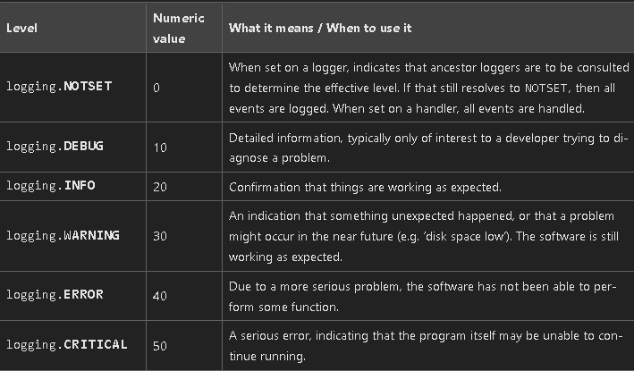

# Aulas

[x] - #A642
[x] - #A643
[x] - #A644
[x] - #A645
[x] - #A646
[x] - #A647
[x] - #A648
[x] - #A649
[x] - #A650
[x] - #A651
[x] - #A652
[x] - #A653
[x] - #A654
[x] - #A655
[x] - #A656
[x] - #A657
[x] - #A658
[x] - #A659
[x] - #A660
[x] - #A661
[x] - #A662
[x] - #A663
[x] - #A664
[x] - #A665
[x] - #A666
[x] - #A667
[x] - #A668
[x] - #A669
[X] - #A670
[ ] - #A671
[ ] - #A672
[ ] - #A673
[ ] - #A674
[ ] - #A675
[ ] - #A676
[ ] - #A677
[ ] - #A678
[ ] - #A679
[ ] - #A680
[ ] - #A681
[ ] - #A682
[x] - #A683
[ ] - #A684
[ ] - #A685
[ ] - #A686
[ ] - #A687
[ ] - #A688
[ ] - #A689
[ ] - #A690
[ ] - #A691
[ ] - #A692
[ ] - #A693
[ ] - #A694
[ ] - #A695
[ ] - #A696
[ ] - #A697
[ ] - #A698
[ ] - #A699
[ ] - #A700
[ ] - #A701
[ ] - #A702
[ ] - #A703
[ ] - #A704
[ ] - #A705
[ ] - #A706
[ ] - #A707
[ ] - #A708
[ ] - #A709
[ ] - #A710
[ ] - #A711
[ ] - #A712
[ ] - #A713
[ ] - #A714
[ ] - #A715
[ ] - #A716
[ ] - #A717
[ ] - #A718

## Anotações:

### Mixins:
```
class AgendamentoDetail(
    mixins.RetrieveModelMixin,
    mixins.UpdatedModelMixin,
    mixins.DestroyModelMixin,
    generics.GenericAPIView
)
    queryset = Agendamento.object.all()
    serializer_class = AgendamentoSerializer
    
    def get(self, request , *args, **kwargs):
        return self.retrieve( request , *args, **kwargs)

    def patch(self, request , *args, **kwargs):
        return self.partial_update( request , *args, **kwargs)

    def put(self, request , *args, **kwargs):
        return self.updated( request , *args, **kwargs)
    
    def delete(self, request , *args, **kwargs):
        return self.destroy( request , *args, **kwargs)


```
-   A ideia dos minix é facilicar a criação do crud de um modelo, vejamos o padrão para criação de um mixin.
    - `queryset`: é onde o mixin vai saber como buscar o modelo
    - `seriaizer_class`: é onde o mixin vai saber como serializar o modelo.

-   Agora temos algumas função based view já implementadas que vamos reutilizar por exemplo: `get`, `patch`, `put`, `delete`. Para cada uma dessas função você terá que passar como argumento `request , *args, **kwargs` e retornar a função desejada.

### GenericView:
-   As generics tem a mesma ideia das mixins só que menos linhas de código:

```python
class AgendamentoDetail(
  generics.RetrieveUpdateDestroyAPIView
)
    queryset = Agendamento.object.all()
    serializer_class = AgendamentoSerializer
```

- Quando tempos uma rota como `api/agendamentos/<pk>` que é um padrão em api rest podemos implementar o Get, Put, Patch e Delete apenas passandos as variáveis `queryset` e `serializer_class` extendendo da classe ` generics.RetrieveUpdateDestroyAPIView`.

- Podemos também personalizar o tipo de queryset ele vai utilizar, no exemplo abaixo estamos adicionado um filtro por path params onde vamos buscar os agendamentos de acordo com o username que é um prestador:
```python
class AgendamentoList(ListCreateAPIView):
    serializer_class = AgendamentoSerializer

    def get_queryset(self):
        username = self.request.query_params.get("username", None)
        queryset = Agendamento.objects.filter(prestador__username=username)
        return queryset


```

## Validatoções:
- As validações do django seguem uma sequência
1.  validar os tipos passados -> int = str?
2.  validações específicas: def validate_prestador
3.  validação geral : def validate

```python
class AgendamentoSerializer(serializers.ModelSerializer):
    class Meta:
        model = Agendamento
        fields = [
            "id",
            "data_horario",
            "nome_cliente",
            "email_cliente",
            "telefone_cliente",
            "cancelado",
            "prestador",
        ]

    prestador = serializers.CharField()

    def validate_prestador(self, value):
        try:
            prestador = User.objects.get(username=value)
        except User.DoesNotExist as e:
            raise serializers.ValidationError("Prestador não encontrado.") from e
        return prestador

    def validate_data_horario(self, value):
        if value < timezone.now():
            raise serializers.ValidationError(
                "Não é possível agendar para um horário no passado."
            )
        return value

```

## Permissões:
- No django podemos fazer validações especificas usando a Basic Auth passando o username e senha, podemos permitir tanto á nivel de url quanto de obj:

```python

class IsOwnerOrCreateOnly(permissions.BasePermission):
    def has_permission(self, request, view):
        if request.method == "POST":
            return True
        username = request.query_params.get("username", None)
        return request.user.username == username


class IsPrestador(permissions.BasePermission):
    def has_object_permission(self, request, view, obj):
        return request.user == obj.prestador

```
- Vemos que na classe `IsOwnerOrCreateOnly` eu varifico apenas se o metodo chamado é um post e se o username é igual ao user que está tentando criar o obj.

- Na segunda estamos mais focado se o obj que é do user que faz a request.


### Regras de negócios:

"""
- Qualquer cliente (autenticado ou não) seja capaz de criar um agendamento
- Apenas o prestador de serviço pode vizualizar todos os agendamentos de sua agenda
- Apenas o prestador de serviço pode manipular os seus agendamentos 
"""

### Pytest-cov

- Esta lib vai fazer a verificação no seu projeto para verificar a cobertura de test do seu código, podendo ser utilizado em CI para subir projetos. Ex:
```

---------- coverage: platform linux, python 3.11.1-final-0 -----------
Name                                       Stmts   Miss  Cover   Missing
------------------------------------------------------------------------
manage.py                                     12     12     0%   2-22
src/agenda/serializers.py                     44     13    70%   26-27, 37, 54-60, 63-74
src/externals/api/brasil_api/feriados.py      17     11    35%   13-23
------------------------------------------------------------------------
TOTAL                                        266     36    86%
```

### lOGGING
Podemos utilizar do logging para fazer monitoramento da executação de nosso código e para sinalizar como esta sua funcionalidade. Por exemplo: neste projeto fazemos uma requisição a uma API externa e caso essa API esteja fora do ar eu não quero que meu sistema caia então eu adicionei um log de error para sinalizar essa situação.

Abaixo temos uma tabela explicando os tipos de log:



